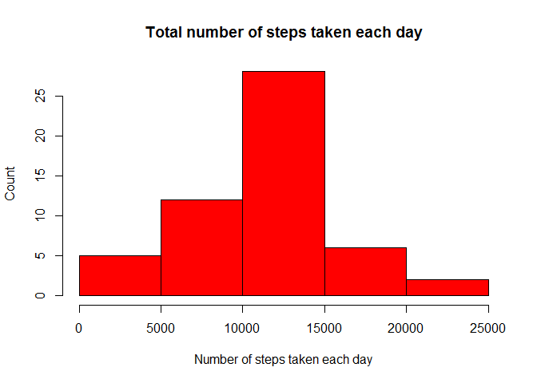
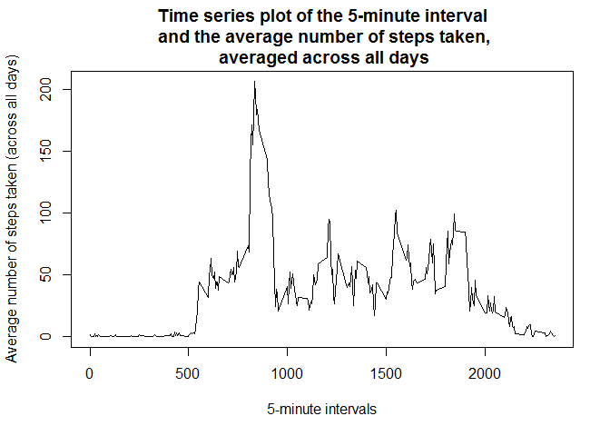
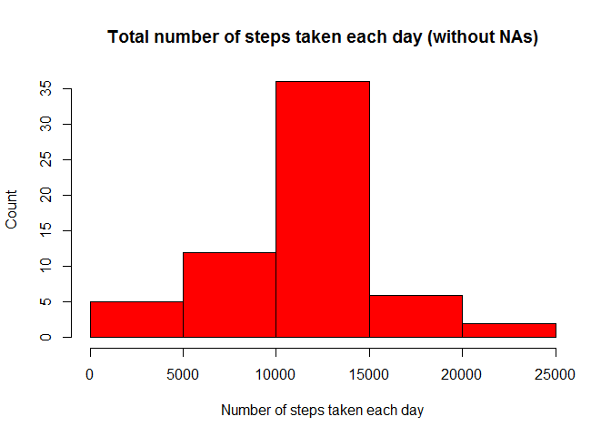
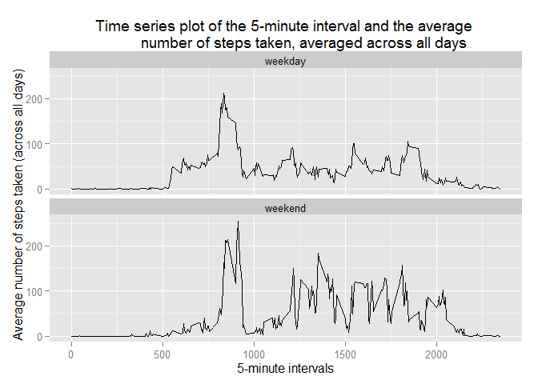

# Reproducible Research: Peer Assessment 1
Renaud DEMARNEFFE  


## Loading and preprocessing the data
1. First, we will unzip the input data.
    
    *We made the assumption that the input zip file is into the working directory.*
    
    
    ```r
    # Unzip and read file.
    unzip("activity.zip")
    activityDS <- read.csv("activity.csv", header = TRUE, sep = ",")
    ```

2. After, we read the csv file, convert date field into date and factor and print the first lines.
    
    ```r
    # Convert columns.
    activityDS$date <- as.Date(activityDS$date, "%Y-%m-%d")
    activityDS$dateFactor <- factor(activityDS$date)
    
    # Print first lines.
    head(activityDS)
    ```
    
    ```
    ##   steps       date interval dateFactor
    ## 1    NA 2012-10-01        0 2012-10-01
    ## 2    NA 2012-10-01        5 2012-10-01
    ## 3    NA 2012-10-01       10 2012-10-01
    ## 4    NA 2012-10-01       15 2012-10-01
    ## 5    NA 2012-10-01       20 2012-10-01
    ## 6    NA 2012-10-01       25 2012-10-01
    ```


## What is mean total number of steps taken per day?

1. First, compute the sum of the number of steps per day and print the first lines of the result.
    
    ```r
    # Compute the sum of the number of steps per day.
    sumStepsPerDay <- aggregate(steps ~ date, data=activityDS, sum, na.rm = TRUE)
    head(sumStepsPerDay)
    ```
    
    ```
    ##         date steps
    ## 1 2012-10-02   126
    ## 2 2012-10-03 11352
    ## 3 2012-10-04 12116
    ## 4 2012-10-05 13294
    ## 5 2012-10-06 15420
    ## 6 2012-10-07 11015
    ```

2. Then, build a histogram plot with the total number of steps taken each day.
    
    ```r
    # Plot the histogram with the total number of steps taken each day.
    hist(sumStepsPerDay$steps, main="Total number of steps taken each day",
         xlab = "Number of steps taken each day", ylab="Count", col="red")
    ```
    
     

3. Finally, compute the mean and median of the total number of steps taken per day.
    
    ```r
    # Compute the mean and median of the total number of steps taken per day.
    meanStepsPerDay <- mean(sumStepsPerDay$steps)
    medianStepsPerDay <- median(sumStepsPerDay$steps)
    ```
    
    The mean of the total number of steps taken per day is : ``10766.188679``
    
    The median of the total number of steps taken per day is : ``10765.000000``


## What is the average daily activity pattern?

1. First, compute the mean of steps per interval across all days and show the first lines of the result.
    
    ```r
    # Compute the mean of steps per interval across all days and show the first lines of the result.
    meanStepsPerInterval <- aggregate(steps ~ interval, data = activityDS, mean, na.rm = TRUE)
    head(meanStepsPerInterval)
    ```
    
    ```
    ##   interval     steps
    ## 1        0 1.7169811
    ## 2        5 0.3396226
    ## 3       10 0.1320755
    ## 4       15 0.1509434
    ## 5       20 0.0754717
    ## 6       25 2.0943396
    ```

2. After, build the time series plot of the 5-minute interval and the average number of steps taken, averaged across all days.
    
    ```r
    # Plot of the 5-minute interval and the average number of steps taken, averaged across all days
    plot(x = meanStepsPerInterval$interval, y = meanStepsPerInterval$steps ,type = "l",
         main = "Time series plot of the 5-minute interval\n and the average number of steps taken,\n averaged across all days",
         xlab = "5-minute intervals", ylab = "Average number of steps taken (across all days)")
    ```
    
     

3. Finally, compute the 5-minute interval, on average across all the days in the dataset, that contains
the maximum number of steps.
    
    ```r
    # Compute the 5-minute interval, that contains the maximum number of steps.
    intervalWithMaxAvgNumberSteps <- meanStepsPerInterval[which.max(meanStepsPerInterval$steps),]
    ```
    
    The 5-minute interval that has the maximum number of steps on
    average across all the days in the dataset is the ``835``^^th^^.
    
    The maximum number of steps is **``206.1698113``**.


## Imputing missing values

1. First, we calculate and report the total number of missing values in the dataset
(i.e. the total number of rows with NAs).
    
    ```r
    # Calculate and report the total number of missing values in the dataset.
    missingValueNumber <- sum(is.na(activityDS$steps))
    ```

    The number of rows in the dataset with minimum a missing value is ``2304``.

2. As strategy, we replace missing values by the mean of that 5-minute interval. We use the mean value 
of the 5-minutes interval across all days in place of the mean of the values of the day.
Furthermore, for some days, therre are no values for the day (for example: 2012-10-01).

3. We fill in all of the missing values in the dataset.

    To do so, we build the median value per interval and then browse each row of the file
    to replace the NA with the mean of the day of the row. We print the first lines of the
        new dataset to verify that NAs are replaced.
    
    ```r
    meanStepsPerInterval <- aggregate(steps ~ interval, data = activityDS, mean, na.rm = TRUE)
    # Replace missing values by the mean of that 5-minute interval.
    activityDSWoNA <- activityDS
    for (i in 1:nrow(activityDSWoNA))
    {
      if (is.na(activityDSWoNA$steps[i]))
      {
        activityDSWoNA$steps[i] <- meanStepsPerInterval[meanStepsPerInterval$interval == activityDSWoNA$interval[i],2]
      }
    }
    head(activityDSWoNA)
    ```
    
    ```
    ##       steps       date interval dateFactor
    ## 1 1.7169811 2012-10-01        0 2012-10-01
    ## 2 0.3396226 2012-10-01        5 2012-10-01
    ## 3 0.1320755 2012-10-01       10 2012-10-01
    ## 4 0.1509434 2012-10-01       15 2012-10-01
    ## 5 0.0754717 2012-10-01       20 2012-10-01
    ## 6 2.0943396 2012-10-01       25 2012-10-01
    ```

4. We plot the same histogram as above but with NA replaced into the dataset.
histogram of the total number of steps taken each day
    
    ```r
    # Compute the sum of the number of steps per day.
    sumStepsPerDayWoNA <- aggregate(steps ~ date, data=activityDSWoNA, sum, na.rm = TRUE)
    # Plot the histogram with the total number of steps taken each day.
    hist(sumStepsPerDayWoNA$steps, main="Total number of steps taken each day (without NAs)",
         xlab = "Number of steps taken each day", ylab="Count", col="red")
    ```
    
     

    Finally, we compute the mean and median of the total number of steps taken per day.
    
    ```r
    # Compute the mean and median of the total number of steps taken per day.
    meanStepsPerDayWoNA <- mean(sumStepsPerDayWoNA$steps)
    medianStepsPerDayWoNA <- median(sumStepsPerDayWoNA$steps)
    ```
    The mean of the total number of steps taken per day with NA replaced by the median of that 5-minute interval is :
    ``10766.188679`` in place of ``10766.188679`` when NA are not replaced.
    
    The median of the total number of steps taken per day with NA replaced by the median of that 5-minute interval is :
    ``10766.188679`` in place of ``10765.000000`` when NA are not replaced.
    
    As we see on the results printed above, with this strategy of replacement of NAs values, the mean and median values of
    steps taken per day stays almost the same as before replacement of NAs.

## Are there differences in activity patterns between weekdays and weekends?

1. We first compute the new factor variable in the dataset with two levels - "weekday" and "weekend" -
indicating whether a given date is a weekday or weekend day.
    
    ```r
    # Compute a new column (factor) with information about weekend or weekday.
    activityDSWoNA$weekday[as.POSIXlt(activityDSWoNA$date)$wday >= 6] <- "weekend"
    activityDSWoNA$weekday[as.POSIXlt(activityDSWoNA$date)$wday < 6] <- "weekday"
    activityDSWoNA$weekday <- factor(activityDSWoNA$weekday)
    ```

2. Compute the mean of number of the 5-minute interval and steps taken across all weekday days or weekend days.
    
    ```r
    # Compute the mean of number of the 5-minute interval and steps taken across all weekday days or weekend days.
    meanStepsPerIntervalAndWeekday <- aggregate(steps ~ interval + weekday, data = activityDSWoNA, mean, na.rm = TRUE)
    head(meanStepsPerIntervalAndWeekday)
    ```
    
    ```
    ##   interval weekday      steps
    ## 1        0 weekday 1.94375222
    ## 2        5 weekday 0.38447846
    ## 3       10 weekday 0.14951940
    ## 4       15 weekday 0.17087932
    ## 5       20 weekday 0.08543966
    ## 6       25 weekday 2.37095052
    ```
    
    Then, plot two time series plots, one for weekdays and one for weekend days, with the 5-minute interval
    and the average number of steps taken.
    
    ```r
    library(ggplot2)
    ggplot(meanStepsPerIntervalAndWeekday, aes(interval, steps)) +
      geom_line() +
      facet_wrap(~ weekday, nrow = 2) +
      ggtitle("Time series plot of the 5-minute interval and the average 
             number of steps taken, averaged across all days") +
      labs(x = "5-minute intervals", y = "Average number of steps taken (across all days)")
    ```
    
     
    
    We can see that the peak activity is higher during week days over weekend days but that there are more peaks
    during a weekend day. It's probably due to free time activities that are mainly done during weekend days.

